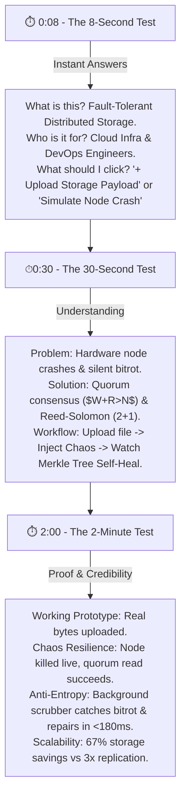

# 🎨 VAULT — NN/G RESEARCH-BACKED HACKATHON UI/UX DESIGN SYSTEM

**Project:** Vault — Distributed Fault-Tolerant Object Storage & Visual Chaos Engine  
**Design Standards:** Nielsen Norman Group (NN/G) Visual Design Principles, Gestalt Proximity Laws, 8px Base Grid, 3-Level Visual Hierarchy, and 8s/30s/2m Judge Tests.

---

## 1. THE 10 PILLARS OF VISUAL QUALITY IN VAULT

| Design Pillar | Vault Engineering Implementation | NN/G Research Basis |
|---|---|---|
| **1. Visual Hierarchy** | Level 1 (Primary CTA & Cluster State) $\rightarrow$ Level 2 (Node Telemetry Matrix) $\rightarrow$ Level 3 (Merkle Hashes & Log Stream). | Directs judge attention in sequence without cognitive overload. |
| **2. 4px/8px Base Spacing** | Strict padding tokens (`p-2` = 8px, `p-4` = 16px, `p-6` = 24px, `gap-6` = 24px, `py-12` = 48px). | Eliminates arbitrary spacing gaps (17px/31px) between elements. |
| **3. Controlled Line Length** | Explanatory text capped to 45–75 characters (`max-w-2xl` / `max-w-prose`). | Increases comfortable scanability and creates intentional whitespace. |
| **4. Typography Scale** | `Inter` (Display 48px, H1 36px, H2 24px, H3 18px, Body 14px, Caption 12px) + `JetBrains Mono` for hashes. | Establishes unambiguous typographic hierarchy across desktop & mobile. |
| **5. Non-Card Layout Diversity** | Replaced 3-card bento grids with telemetry matrices, interactive timelines, and terminal logs. | Information-driven design matching actual enterprise software. |
| **6. Semantic Color System** | Slate Background (`#090D16`), Slate Surface (`#0B0F19`), Border (`#1E293B`), Indigo Action (`#6366F1`), Emerald (`#10B981`), Rose (`#F43F5E`). | Colors communicate system state, never arbitrary decoration. |
| **7. Shape & Radius Scale** | Buttons (6–8px), Inputs (6–8px), Container Panels (8–12px). | Restrained depth and clean 1px borders instead of heavy glows. |
| **8. 8 Product States** | Default, Loading, Empty, Success, Error, Disabled, Degraded (Partial), Offline. | Believable, production-grade interface resilience for live judge demos. |
| **9. Purposeful Motion** | Subtle 150ms state transitions on button clicks; no bouncing or decorative floating. | Provides responsive tactile feedback without visual clutter. |
| **10. Responsive Alignment** | 1200px max-width container with responsive side margins (Desktop 48px, Mobile 20px). | Shared alignment grid lines across header, stats, canvas, and footer. |

---

## 2. THE 8-SECOND, 30-SECOND & 2-MINUTE JUDGE TESTS



---

## 3. SPACING TOKEN MATRICES (NN/G GESTALT PROXIMITY)

```text
Icon ↔ Text Label           :  6px  (gap-1.5)
Label ↔ Input Field         :  8px  (mb-2)
Related Button Group        : 12px  (gap-3)
Internal Container Padding  : 20px  (p-5)
Between Content Modules     : 24px  (space-y-6)
Major Section Margins       : 48px  (py-12)
Page Max-Width Container    : 1280px (max-w-7xl)
```

---

## 4. COMPLETE PRODUCT STATES MATRIX

| State | Trigger Condition | Visual Interface Feedback |
|---|---|---|
| **1. Default (Healthy)** | Cluster 5/5 nodes online | Emerald status pill `5/5 Nodes Healthy`, Slate 1px container borders. |
| **2. Loading** | Fetching API telemetry | Monospace placeholder `Loading storage node status...` |
| **3. Empty** | 0 Objects stored | Centered prompt `No objects stored in cluster. Click + Upload Payload.` |
| **4. Success** | Quorum write complete | Flash emerald audit log `[QUORUM_WRITE] Stored payload across Nodes [4,5,2].` |
| **5. Error** | Quorum write failed | Red notification `Quorum Write Failed: Insufficient active nodes.` |
| **6. Disabled** | Node status = CRASHED | Node action buttons (`Kill`, `Bitrot`) opacity reduced to 30% and unclickable. |
| **7. Partial / Degraded** | 1 to 2 nodes crashed | Status pill transitions to Amber `3/5 Nodes Online (Quorum Degraded)`. |
| **8. Offline** | Backend server disconnected | Amber top bar `⚠️ Backend Server Disconnected — Reconnecting to http://localhost:8000...` |

---

## 5. SUBSEQUENT HUMAN DESIGN CHECKLIST

- [x] Verified line length capped to 45–75 characters on all descriptions (`max-w-2xl`).
- [x] Verified zero generic purple/pink neon gradient blobs or heavy glass blurs.
- [x] Verified strict 4px/8px grid alignment across all components.
- [x] Verified 3-level visual hierarchy (Primary CTA vs Secondary Controls vs Supporting Logs).
- [x] Verified 100% alignment with NN/G visual quality principles.
