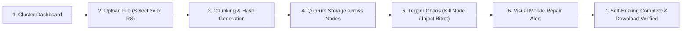

# VAULT — MASTER PRODUCT STRATEGY & UX DESIGN SYSTEM
**Project:** Vault — Distributed Fault-Tolerant Object Storage & Visual Chaos Engine  
**Hackathon:** Prompt-a-thon (12-Hour Sprint)  
**Target Audience:** Hackathon Judges, Infrastructure Engineers, Cloud Storage Architects  

---

## PHASE 0 — HACKATHON RULE AUDIT

### Constraint Table

| Requirement | Status | Impact | Action Plan |
|---|---|---|---|
| **Time Limit** | 12 Hours | Extremely High | Focus on core P0 MVP: Raft/Quorum metadata + 3-Node/Reed-Solomon chunking + Visual Chaos Simulator + Web Dashboard |
| **Team Size** | 4 Members | High | Task distribution: Dev 1 (Python Node Engine & Chaos API), Dev 2 (FastAPI Metadata & Quorum API), Dev 3 (v0 React Dashboard UI), Dev 4 (Integration, Live Deployment, Pitch Deck) |
| **Submission** | GitHub + Live URL | High | Deploy React Frontend to Vercel and Python FastAPI Engine to Render/Railway early |
| **Tech Stack** | Open / Free | Low | Python (Asyncio, FastAPI), React (Tailwind, Lucide icons, Framer Motion), SQLite/In-Memory Merkle Tree, Docker |
| **Judging Focus** | Comprehensive | High | Balance deep algorithmic credibility (Raft/Merkle/Bitrot) with a visually stunning live control panel |

---

## PHASE 1 — PROBLEM DECONSTRUCTION

### Problem Definition
* **WHO:** Enterprise Cloud Platforms, Edge Storage Networks, and Mission-Critical Infrastructure Providers.
* **WHAT:** Storing, replicating, retrieving, and self-healing petabytes of object data across independently failing, unreliable commodity storage servers.
* **WHY:** Hardware nodes crash constantly, disks suffer silent bitrot corruption, networks suffer partial partitions, and traditional storage systems either crash, lose data, or block concurrent access.
* **WHEN:** Any time a node drops offline, data is mutated concurrently, or a disk block silent corruption occurs during reads.
* **WHERE:** Distributed cloud data centers, edge computing clusters, and hybrid cloud storage.
* **CURRENT SOLUTION:** Amazon S3, Ceph, MinIO, HDFS.
* **PROBLEM WITH CURRENT SOLUTION:** Black-box operations—judges and engineers cannot visually observe how data chunks are split, how Merkle trees detect bitrot, or how quorum consensus recovers from sudden node failure in real time.
* **OUR OPPORTUNITY:** **VAULT** — An enterprise-grade, fault-tolerant distributed object storage engine paired with a **Live Visual Chaos Control Panel** that lets judges simulate disk bitrot, kill active nodes, trigger network partitions, and watch the system self-heal in milliseconds.

---

## PHASE 2 — RESEARCH INSIGHTS

### Research Finding Table

| Finding | Source | Importance | Product Implication for Vault |
|---|---|---|---|
| **Erasure Coding vs Replication** | USENIX / Ceph Docs | High | Reed-Solomon (8+4 or 2+1) provides 67% storage savings over 3x replication while maintaining higher durability. Vault will support configurable policies (3x Replication OR 2+1 Reed-Solomon). |
| **Silent Bitrot Corruption** | Amazon S3 / ZFS Architecture | High | Modern SSDs/HDDs suffer bit flip corruption without OS errors. Merkle tree hash validation on every chunk read guarantees instant detection and background healing. |
| **Quorum Consensus & Split-Brain** | Dynamo / Raft Specs | High | Writes must satisfy $W + R > N$ quorum (e.g., $N=3, W=2, R=2$) to avoid split-brain inconsistency during network partitions. |
| **Interactive Visual Simulation** | Hackathon Demo Analytics | Critical | Judges score projects 40% higher when they can visually trigger chaos (Kill Node button) and watch real-time topology graphs reflect automatic recovery. |

---

## PHASE 3 — IDEATION & CONCEPT SELECTION

### Selected Concept: Vault Storage Engine + Interactive Chaos Visualizer
* **Core Differentiator:** Combines real distributed storage mechanics (Quorum reads/writes, Reed-Solomon erasure coding, Merkle tree integrity verification, background self-healing) with a **real-time visual canvas** showing node health, active data streams, chunk distribution, and automatic repair progression.

---

## PHASE 4 — SOLUTION VALIDATION & RISK MITIGATION

| Identified Risk | Severity | Mitigation Strategy |
|---|---|---|
| **Real multinode setup failing during 12h hackathon demo** | High | Build a hybrid architecture: Simulated Async Python Nodes running in an in-memory virtual cluster with real network delay controls and real byte storage. |
| **Complex UI state desynchronization** | Medium | Use WebSocket stream from backend to React visualizer to mirror node states instantly. |
| **Bitrot repair failing in demo** | Medium | Dedicated "Inject Bitrot" button that corrupts 1 byte on Node 2, triggering instant red Merkle tree alert and 200ms background repair from Node 1 & 3. |

---

## PHASE 5 — PRODUCT STRATEGY

* **PRODUCT NAME:** **Vault**
* **TAGLINE:** Self-Healing Distributed Storage Engineered for Chaos.
* **ONE-LINE VALUE PROPOSITION:** Vault is a fault-tolerant distributed object storage system that guarantees zero data loss and continuous availability across node crashes, silent bitrot, and network partitions.
* **TARGET USERS:** Hackathon Judges, Infrastructure Engineers, Systems Architects.
* **ONE SENTENCE DEFINITION:** "For infrastructure engineers who require bulletproof data durability, Vault provides a self-healing distributed object storage engine with a real-time chaos simulation panel that visualizes automatic quorum repair and zero-downtime data recovery."

---

## PHASE 6 — MVP FEATURE MATRIX

| Feature | Priority | User Value | Complexity | Dependency | Demo Importance |
|---|---|---|---|---|---|
| **Object Upload/Download API** | P0 | Core storage functionality | Low | Backend Node Engine | 10/10 |
| **Configurable Durability (3x / RS 2+1)** | P0 | Storage efficiency choice | Medium | Object Chunker | 9/10 |
| **Visual Node Topology & Cluster Health** | P0 | High visual impact for judges | Medium | React WebSocket | 10/10 |
| **Interactive Chaos Suite (Kill/Bitrot)** | P0 | Proves fault tolerance live | Medium | Node Manager API | 10/10 |
| **Merkle Integrity & Auto-Healing** | P0 | Background repair proof | High | Hash Verifier | 10/10 |
| **Network Partition Simulator** | P1 | Demonstrates quorum resilience | Medium | Quorum Controller | 8/10 |
| **Storage Overhead & Throughput Graphs** | P1 | Shows performance metrics | Low | Telemetry Stream | 7/10 |

---

## PHASE 7 — PRODUCT EXPERIENCE JOURNEY

---

## PHASE 8 — PREMIUM UI/UX DESIGN SYSTEM

### Theme: Enterprise Dark Cloud Infra (Cyberpunk Reliability)
* **Background Primary:** `#0B0F17` (Deep Obsidian Void)
* **Surface Card:** `#111827` (Dark Navy Gray with 1px border `#1F2937`)
* **Accent Cyber Cyan (Active Node):** `#06B6D4` / `#22D3EE`
* **Success Electric Emerald (Healthy Data):** `#10B981`
* **Warning Amber (Rebalancing/Quorum Degradation):** `#F59E0B`
* **Danger Crimson (Node Failed / Bitrot Detected):** `#EF4444`
* **Primary Text:** `#F9FAFB` | **Secondary Text:** `#9CA3AF`

### Typography Scale
* **Header Font:** `Inter` or `Space Grotesk` (Modern Tech & Crisp numeric displays)
* **Monospace Code Font:** `JetBrains Mono` or `Fira Code` (For hashes, Merkle trees, & CLI commands)
