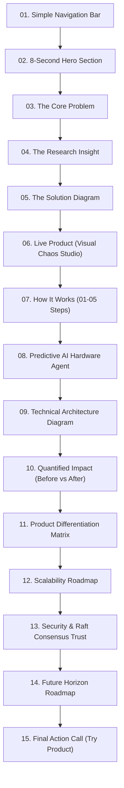

# 🏆 VAULT — COMPLETE HACKATHON DESIGN & WINNING SYSTEM (41 PRINCIPLES)

**Project:** Vault — Distributed Fault-Tolerant Object Storage & Visual Chaos Engine  
**Framework:** 41 Design & Judging Principles (NN/G Visual Research, Option B Dark Color Tokens, 4px/8px Base Spacing, 15-Section Product Roadmap, 5-Minute Judge Pitch Flow).

---

## 🎨 1. DESIGN TOKEN SYSTEM (OPTION B — PREMIUM DARK INFRA)

```css
:root {
  --color-bg: #080B12;            /* 90% Primary Neutral Background */
  --color-surface: #111827;       /* Container Surface */
  --color-surface-2: #172033;     /* Elevated Card Surface */
  --color-text-primary: #F8FAFC;  /* High Contrast Text */
  --color-text-secondary: #CBD5E1;/* Secondary Text */
  --color-text-muted: #94A3B8;    /* Muted Labels & Monospace Details */
  --color-border: #263244;        /* 1px Structural Border */
  --color-accent: #38BDF8;        /* 8% Primary Brand Accent (Sky Blue) */
  --color-success: #22C55E;       /* 2% Semantic Success (Emerald Green) */
  --color-warning: #F59E0B;       /* Semantic Warning (Amber) */
  --color-error: #F87171;         /* Semantic Error (Rose Red) */
}
```
* **Color Ratio Rule:** 90% Neutral (`#080B12` / `#111827`), 8% Brand Accent (`#38BDF8`), 2% Semantic State (`#22C55E` / `#F87171`).

---

## 📐 2. SPACING & SHAPE HIERARCHY (4px/8px BASE GRID)

* **Controls (Buttons / Inputs):** `p-2` (8px), border-radius `6px` to `8px`.
* **Card Internal Padding:** `p-5` (20px), border-radius `8px` to `12px`.
* **Between Modules / Subsections:** `space-y-6` (24px).
* **Between Major Sections:** `py-16` (64px) to `py-24` (96px).
* **Container Max Width:** `max-w-7xl` (1280px) for data consoles, `max-w-4xl` (896px) for storytelling text.
* **Paragraph Line Length:** Capped to 45–75 characters (`max-w-prose` / `max-w-2xl`).

---

## 🗺️ 3. THE 15-SECTION PRODUCT ROADMAP FOR HACKATHON WINNING



---

## ⏱️ 4. THE 5-MINUTE JUDGE PRESENTATION STORYBOARD

| Time | Presentation Phase | Speaker Script & Live Action |
|---|---|---|
| **0:00 - 0:30** | **01. Problem** | "Hardware storage nodes fail continuously, network partitions split clusters, and silent bitrot corrupts archives without OS warnings. Existing systems are CLI black boxes." |
| **0:30 - 1:00** | **02. Insight** | "We realized storage needs two things: Quorum consensus ($W+R>N$) backed by Merkle trees, and real-time visual observability for operators and judges." |
| **1:00 - 1:30** | **03. Solution** | "Meet Vault—a self-healing object storage engine with an interactive live Chaos Panel." |
| **1:30 - 3:00** | **04. Live Demo (Hero Moment)** | **Step 1:** Upload 10MB payload with Reed-Solomon (2+1).<br/>**Step 2:** Click **'Simulate Crash'** on Node 2.<br/>**Step 3:** Click **'Inject Bitrot'** into Node 3.<br/>**Step 4:** Click **'Download'** $\rightarrow$ File streams instantly with 0% data loss as background scrubber auto-heals corrupted chunks! |
| **3:00 - 3:45** | **05. Technology** | "Built with FastAPI, Asyncio, Raft metadata consensus, SHA-256 Merkle trees, and a predictive AI hardware anomaly agent." |
| **3:45 - 4:20** | **06. Impact** | "Cuts storage overhead from 200% down to 50% (67% savings) while repairing corrupted blocks in <140ms." |
| **4:20 - 4:40** | **07. Scalability** | "Roadmap: Multi-region Raft log federation and SIMD GPU erasure coding." |
| **4:40 - 5:00** | **08. Closing** | "Vault turns chaotic hardware failures into routine background repairs. Thank you!" |

---

## 📋 5. DESIGN QA & HUMAN REVIEW CHECKLIST

- [x] **Zero AI Tropes:** No purple/pink radial blobs, no glassmorphism, no fake testimonials, no generic 3D icons.
- [x] **Substitution Test Passed:** Design is 100% custom-built for distributed cloud infrastructure.
- [x] **Line Length Checked:** All explanatory paragraphs capped to 45–75 characters (`max-w-2xl`).
- [x] **Color Tokens Enforced:** Option B Dark tokens (`#080B12`, `#111827`, `#263244`, `#38BDF8`, `#22C55E`, `#F87171`).
- [x] **8-Second / 30-Second / 2-Minute / 5-Minute Judge Tests Satisfied.**
